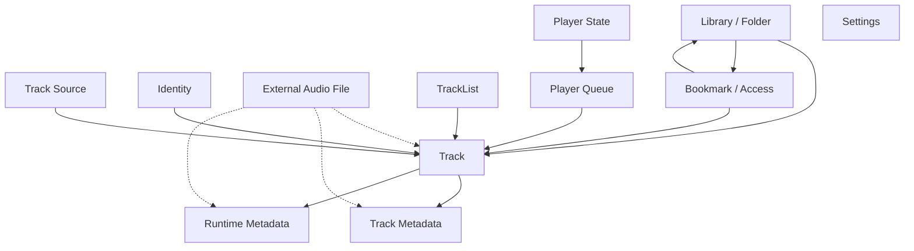

# Назначение

Data Model описывает логические сущности BurningTrack и правила владения их состоянием.

Документ не описывает SQLite-схему, таблицы, поля, индексы или запросы. Его задача — зафиксировать, какие сущности существуют в приложении, кто владеет их постоянным состоянием и как эти сущности связаны между собой на уровне архитектуры.

SQLite хранит внутреннее рабочее состояние этих сущностей. Музыкальные файлы пользователя, экспортированные файлы и системные media-объекты остаются внешними ресурсами и не становятся частью SQLite.

# Логическая схема

Концептуальные связи между основными сущностями:

Пунктирная связь с внешним файлом показывает, что файл используется как внешний источник данных или playback-объект, но не принадлежит SQLite.

# Track

Track — устойчивая внутренняя сущность приложения, которая представляет музыкальный объект внутри BurningTrack.

Track имеет стабильную identity и может происходить из разных источников. Он может быть связан с внешним музыкальным файлом, системным media-объектом или пользовательским сценарием импорта.

Track используется разными подсистемами:

- фонотека индексирует треки, найденные во внешних папках;
- треклисты хранят ссылки на Track и собственный порядок;
- очередь плеера хранит ссылки на Track и собственный порядок;
- metadata связывается с track через его identity.

Track не является самим аудиофайлом. Файл остаётся внешним ресурсом, а Track хранит внутреннее состояние приложения, нужное для связи сценариев с этим ресурсом.

# Track Source

Track Source описывает происхождение track на логическом уровне.

Текущие источники:

- фонотека — track найден внутри прикреплённой пользователем структуры папок;
- одиночный импорт — track добавлен как отдельный внешний файл вне дерева фонотеки;
- purchased iTunes — track приходит из системной медиатеки и воспроизводится через системный media-доступ.

Источник влияет на способ доступа к track и восстановления playback-данных. Источник не должен создавать отдельную identity-модель поверх Track Identity.

# Folder / Library

Library описывает прикреплённые пользователем источники файлов и индекс треков, которые приложение видит внутри этих источников.

Folder / Library владеет состоянием фонотеки: прикреплёнными корневыми источниками, их доступностью, логическим индексом найденных файлов и связью Track с этой структурой.

Папки дают доступ к внешним музыкальным файлам. Приложение хранит состояние доступа и индекс, но сами файлы остаются во внешней файловой системе.

Runtime-дерево папок может использоваться для UI и навигации, но источником восстановления внутреннего состояния фонотеки остаётся SQLite через Store.

# Track Metadata

Track Metadata — данные, связанные с track и описывающие его отображаемые или музыкальные свойства.

Metadata может быть прочитана из внешнего файла, получена из системного media-источника или обновлена после изменения файла. Она связана с Track Identity и не должна становиться вторым источником identity.

Runtime metadata и persisted metadata имеют разные роли:

- runtime metadata даёт feature-подсистемам актуальное представление track во время текущей работы приложения;
- persisted metadata хранит восстановимое представление metadata, связанное с Track.

Runtime-кэш metadata можно очистить и пересобрать. Persisted metadata не должна подменять Track Identity и не должна превращаться в параллельное хранилище самого файла.

# TrackList

TrackList — пользовательская коллекция ссылок на Track.

TrackList владеет собственным именем, составом и порядком элементов списка. Он не владеет Track как физическими музыкальными объектами и не владеет аудиофайлами.

Один track может входить в разные треклисты. Один track также может входить в один треклист несколько раз как разные отображаемые элементы, если пользовательский сценарий это допускает.

TrackList может хранить snapshot-данные для стабильного отображения списка. Такой snapshot принадлежит строке списка и не делает TrackList владельцем Track Metadata или Track Identity.

# Player Queue / Player State

Player Queue — упорядоченный набор ссылок на Track, который описывает текущую очередь воспроизведения.

Очередь владеет только составом и порядком своих элементов. Она не владеет Track, metadata или аудиофайлами.

Очередь может хранить snapshot-данные, чтобы восстановить стабильное отображение элементов после перезапуска. Эти данные не заменяют Track Identity и не делают очередь владельцем track.

Player State описывает состояние воспроизведения отдельно от очереди. Он может ссылаться на текущий элемент очереди или track, но не владеет ими.

# Settings

Settings — внутреннее состояние приложения, которое управляет поведением и отображением feature-подсистем.

Настройки разделяются по смысловым областям: общие настройки приложения, настройки отображения фонотеки, настройки поведения плеера и будущие внутренние настройки.

Настройки не должны храниться в UI. UI может отображать и менять настройки через соответствующий Manager / Store, но восстановление настроек происходит из SQLite.

# Bookmark / Access

Bookmark / Access описывает право приложения снова получить доступ к внешнему файлу или папке.

Bookmark — это состояние доступа, а не сам файл. Он связан с track или folder и позволяет восстановить доступ к внешнему ресурсу между запусками приложения.

SQLite хранит состояние доступа, но не хранит аудиофайл. Потеря доступа к внешнему ресурсу должна отражаться как состояние доступности, а не как удаление внутренней сущности без сценария, который явно это требует.

# Identity

Identity — правило стабильности, которое связывает разные сценарии приложения с одним и тем же track.

Identity не должна зависеть от тегов, обложки, длительности, временного UI-состояния или конкретной строки в списке. Изменение metadata не должно создавать новый track.

Разные источники могут иметь разные правила построения identity. Фонотека использует логику, связанную с прикреплённым источником и логическим положением файла внутри него. Одиночный импорт использует собственное правило для внешнего файла вне фонотеки. Purchased iTunes использует системный источник как отдельный тип происхождения track.

Identity нужна, чтобы фонотека, треклисты, очередь плеера, metadata и file-facing сценарии ссылались на один и тот же track согласованно.

# Ownership Rules

- Track является владельцем своей устойчивой identity.
- Track Source описывает происхождение track, но не владеет его identity отдельно от track.
- Track Metadata владеет данными, связанными с track, но не владеет identity track.
- TrackList владеет только составом и порядком своего списка.
- Player Queue владеет только составом и порядком очереди.
- Player State владеет только состоянием воспроизведения.
- Folder / Library владеет индексом фонотеки и доступом к прикреплённым источникам.
- Bookmark / Access владеет состоянием доступа к внешнему ресурсу.
- Settings владеют настройками приложения.
- Runtime metadata и runtime-кэши не являются владельцами постоянного состояния.
- Внешний аудиофайл не принадлежит SQLite.

# Связанные документы

- [SQLite](SQLite.md)
- [SQLite Schema](SQLite%20Schema.generated.md)
- [Runtime Metadata](Runtime%20Metadata.md)
- [Track Identity](Track%20Identity.md)
- [Library](../Features/Library.md)
- [Player](../Features/Player.md)
- [Tracklists](../Features/Tracklists.md)
